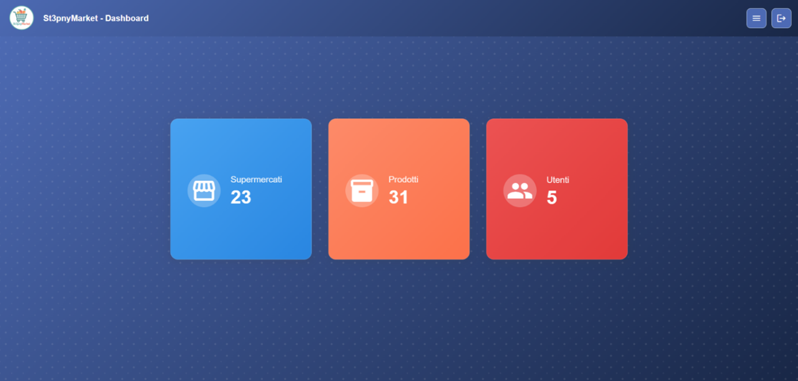
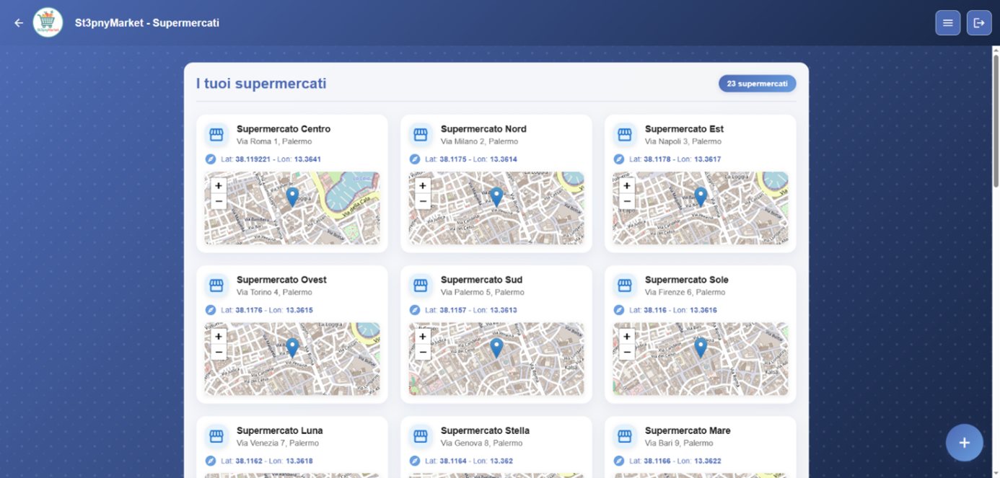
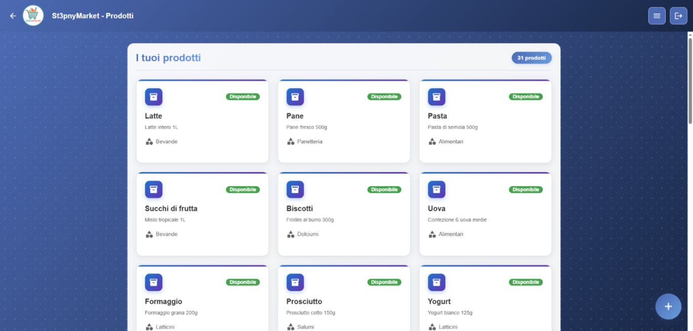
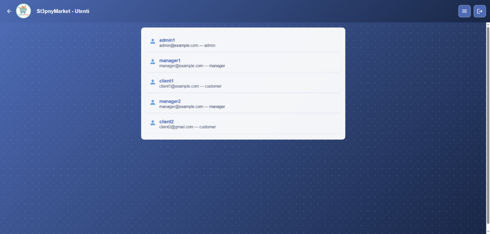
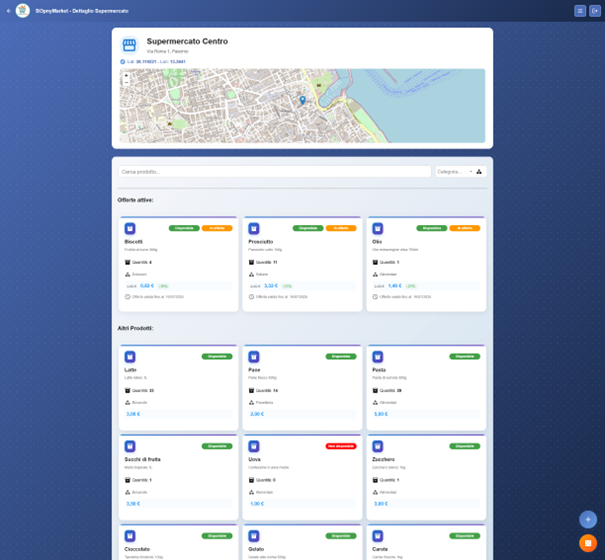
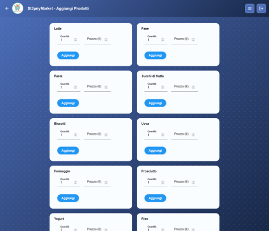
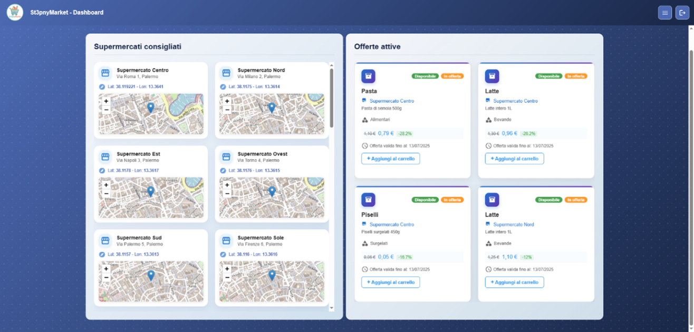
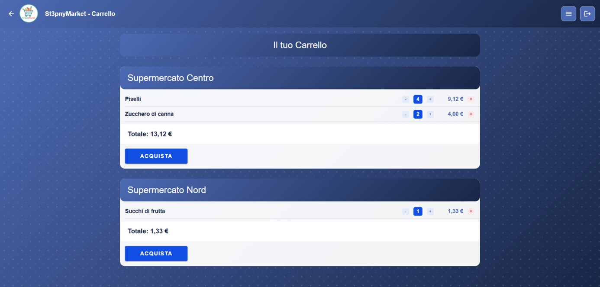
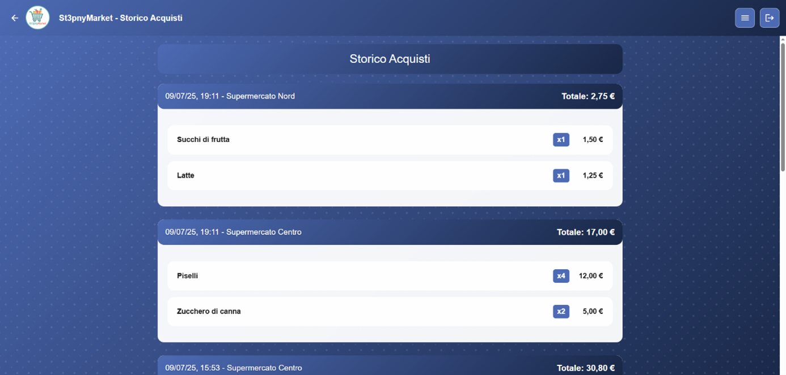
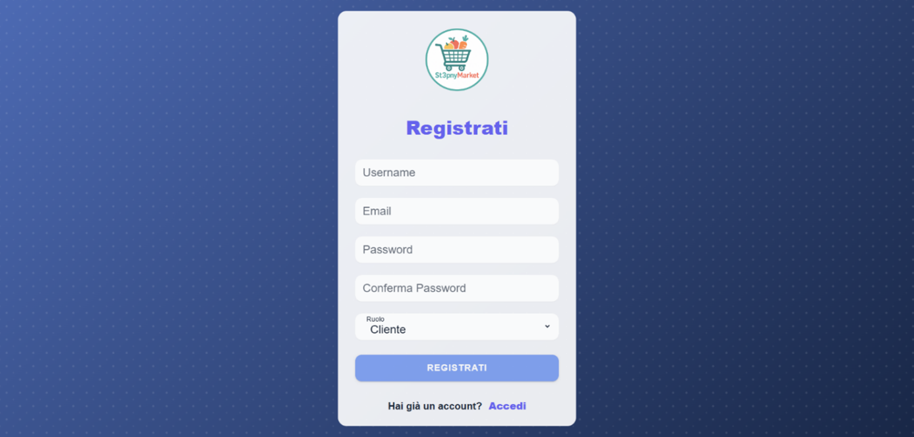

# SupermarketsManager  

_Latest release is 1.0. This file last updated on 10 September 2025._  
_The software has been developed in Italian language for educational purposes._

## Brief Description ##  

**SupermarketsManager** is a hybrid web application developed with **Ionic Angular**, designed to simulate the management of a real supermarket chain.  
The system is built with a **modular, role-based architecture**, clearly distinguishing between **Admin, Manager, and Customer**, offering each role dedicated and customized functionalities according to operational needs.  

Core features include:  
- **Admin**: full management of all supermarkets, creation of supermarkets, products, offers, and monitoring of all users.  
- **Manager**: management of assigned supermarkets and products, with the ability to create offers.  
- **Customer**: browsing all supermarkets and offers, adding products from multiple supermarkets to the cart, and purchasing them.  

Thanks to its clear interface and modular design, SupermarketsManager provides both a **practical simulation tool** and an **educational platform** for studying user-role management in retail environments.  

---

## Installation ##

1. Access the codebase.

2. Install dependencies:
   ```bash
   npm install
   ```

3. Initialize and start the Docker server:
   ```bash
   docker build -f server_docker/Dockerfile -t server_docker server_docker
   docker run -d --name server_docker -v "./server_docker:/app" -p 5000:5000 server_docker:latest
   ```

4. Start the development server:
   ```bash
   ionic serve
   ```

5. The application will be available at: `http://localhost:8100/`


## Test Accounts ##

- Admin - Username: admin1, Password: admin123  
- Manager 1 - Username: manager1, Password: manager123  
- Manager 2 - Username: manager2, Password: manager123  
- Customer 1 - Username: client1, Password: client123  
- Customer 2 - Username: client2, Password: client123  


## Project Structure ##

The project follows a **feature-based modular architecture** with components organized by functionality:

```
src/
├── app/
│   ├── dashboard/       # Dashboard component
│   ├── guards/          # Route guards 
│   ├── header/          # Header component
│   ├── pages/           # Main section of the pages
│   │   ├── admin/       # Admin pages
│   │   ├── auth/        # Authentication and access management pages
│   │   ├── common/      # Reusable common pages or components
│   │   └── customer/    # Customer-specific pages
│   ├── root/            # Root component
│   ├── routes/          # Route configuration
│   └── services/        # Shared services
├── util/
│   ├── card/            # Cards
│   ├── dialog-generico/ # Generic dialog
│   └── mini-map/        # Mini-map
├── assets/              # Static resources
└── environments/        # Environment configurations
```

## Authors ##

- Bonura Michelangelo
- Falcomatà Salvatore
- Spina Luca

## Screenshots ##  

### Admin - Dashboard  
  

### Admin - Supermarkets Page
  

### Admin - Products Page
  

### Admin - Users Page
  

### Supermarket Management  
  

### Products Management  
  

### Customer - Dashboard  
  

### Customer - Cart  
  

### Customer - Purchases History  
  

### Signup  
  
